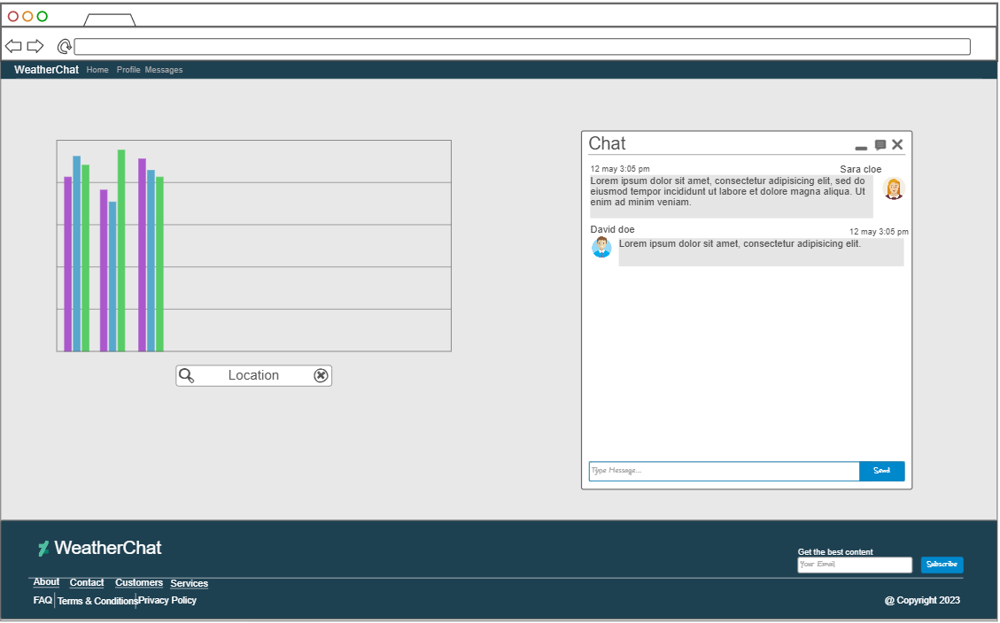

# WeatherChat

This is an application that allows users to view weather data related to their location and chat with others about it.

## Elevator Pitch

Are you the type of person to watch the weather and track everything that's going on? The WeatherChat application
helps you find a like-minded community of weather enthusiasts. You can view weather for your location or input another
location to view. As the weather data is updated, there is a real-time chat to talk with others viewing the same weather
and discuss the goings-on.

## Design

## Key Features

- Secure login over HTTPS
- Ability to use user's location or input location
- Real time weather data
- Up to date chat from other users

## Technologies

I will use the required technologies in the following ways:

- HTML - Use correct HTML structure for pages. Login page and data/chat page.
- CSS - Styling that looks good and stays consistent on different screen sizes,
 unified color scheme, works in light and dark mode
- React - Provides login screen, weather data element, and chat component
- Service - Backend service with endpoints for:
  - login
  - view user profile
  - [AccuWeather API](https://developer.accuweather.com/apis)
    - Location
    - Current Conditions
- DB - Store users and chat logs. Register and log in users with secure credentials
- WebSocket - Chat functionality for all users viewing a specific location in real time.

## HTML Deliverable

For this deliverable, I built out the structure of my website with HTML.

- [x] **HTML pages** - four HTML pages that show the homepage, a chat page, a profile page, and an about page
- [x] **Links** - all pages link to each other and logging in takes the user to the chat page
- [x] **Text** - all the pages include text
- [x] **Images** - I included a blank profile picture on the profile page
- [x] **DB/Login** - there is a form for a user to login or create an account. Each user has a location associated
- [x] **WebSocket** - the realtime chat that allows a user to see others' messages
- [x] **External API** a box on the homepage that includes weather data

## CSS Deliverable

For this deliverable, I properly styled all pages into their final appearance.

- [x] **Header, footer, and main body**
- [x] **Navigation elements** - all elements are styled the same and different from the default HTML
- [x] **Responsive to window resizing** - the website looks good on different window sizes
- [x] **Application elements** - used contrast and spacing for elements
- [x] **Application text content** - consistent fonts
- [x] **Images** - images are included and styled
  - [] **About page image** - this image still needs to have its sizing fixed

## React Deliverable

For this deliverable, I used JavaScript and React so that the application works as a single page application.
