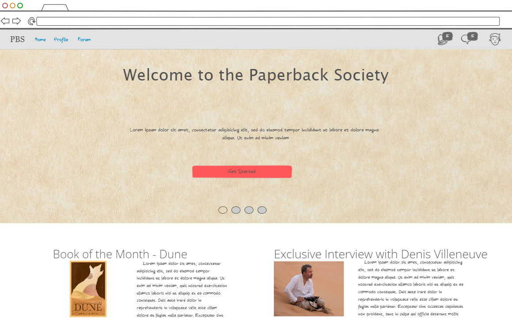

# Paperback Society

### Elevator pitch

Imagine a community where book lovers unite from all corners of the world to embark on literary adventures together. The idea behind {Name} is to provide that community of like-minded people that read the same books together. This online platform will help people to dive into a diverse selection of books, with the additional guidance of discussions, author interviews, a companion podcast, and other engaging activities.

### Design

### Key features

- Secure login over HTTPS
- Ability to interact with forum (writing reviews, community discussion)
- Ability to access additional materials (movies, interviews, podcasts, etc.)
- Rich multimedia page displaying monthly book

### Technologies

I will  use the following technologies:
- **HTML** - various HTML pages to display the different parts of the site, such as the home page, forum, and login page
- **CSS** - website styling so that the page can be displayed correctly on different platforms and different screen sizes with a consistent theme
- **JavaScript** - provides ability to log in, send posts to site, display other posts
- **Service** - backend service with endpoints for
    - login
    - retrieving user posts
    - making new posts
- **DB** - store users, posts, and past books
- **React** - the whole site will use the React framework

### HTML Deliverable

For this deliverable I built out the following:
- **HTML pages** - I built out 4 pages, a home page, a forum page to login and view posts, a profile page to see user info, and an about page
- **Links** - each page has a header with links to all the other pages
- **Text** - the forum page include sample posts to view
- **Image** - I included an image on the about page to show how that may look throughout the site
- **WebSocket** - the actual user log in would be done through a web socket, as well as potential links to books on online marketplaces
- **Database** - the forum posts would be stored in a database